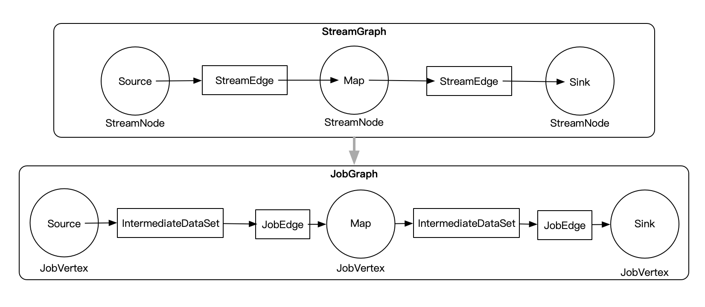
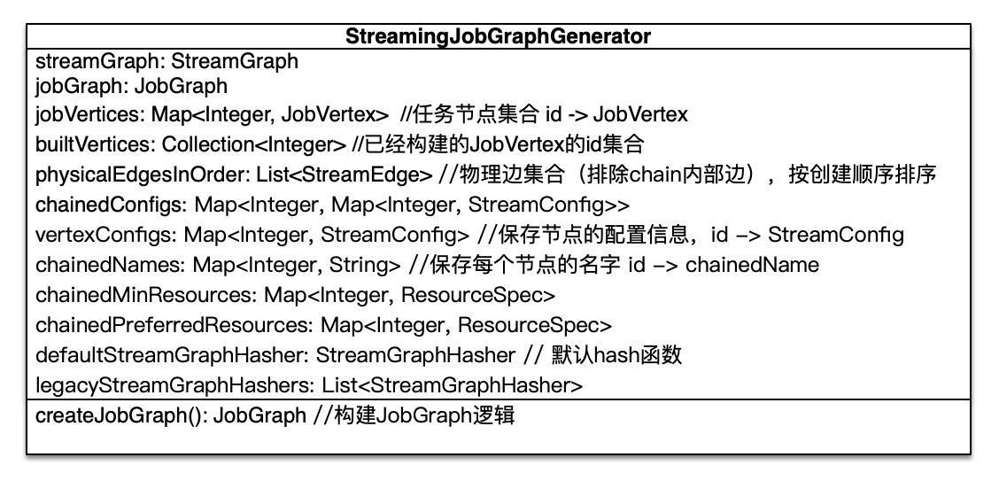

## JobGraph的生成流程
> 文章基于[StreamGraph的生成流程](./StreamGraph的生成流程.md)，建议先阅读StreamGraph的生成流程部分。该篇文章主要介绍JobGraph的生成流程。

### 整体视图
先从整体上看，Flink是如何将StreamGraph转变成JobGraph的。在上篇文章已经介绍了从用户代码到StreamGraph的转变过程，这里就不重复了。我们还是
以上篇文章的例子为例，整体上的转变图如下：


通过远程DEBUG的方式，我们可以单步调试查看JobGraph生成的流程，[具体远程DEBUG的方法](https://github.com/bjkonglu/resume-bjkonglu/issues/9)

### 代码层面分析
JobGraph生成的代码入口是StreamingJobGraphGenerator,通过调用StreamingJobGraphGenerator.createJobGraph(streamGraph, jobID)进入构建JobGraph逻辑。先看一下StreamingJobGraphGenerator代码
的整体结构如下所示：


下面具体看一下*createJobGraph()* 方法的处理逻辑：
```java
private JobGraph createJobGraph() {

		// 设置调度模式为所有节点一起启动
		jobGraph.setScheduleMode(ScheduleMode.EAGER);

		// 广度优先的方式遍历StreamGraph，然后给每个StreamNode生成一个hash id
		// 保证只要提交的拓扑不变，生成的hash id不变
		Map<Integer, byte[]> hashes = defaultStreamGraphHasher.traverseStreamGraphAndGenerateHashes(streamGraph);

		// Generate legacy version hashes for backwards compatibility
		List<Map<Integer, byte[]>> legacyHashes = new ArrayList<>(legacyStreamGraphHashers.size());
		for (StreamGraphHasher hasher : legacyStreamGraphHashers) {
			legacyHashes.add(hasher.traverseStreamGraphAndGenerateHashes(streamGraph));
		}

		Map<Integer, List<Tuple2<byte[], byte[]>>> chainedOperatorHashes = new HashMap<>();

        	// JobGraph生成的主要逻辑，创建JobVertex、JobEdge、IntermediateDataSet等，并将这边连接起来
        	// 如果前后JobVertex可以进行chain，则将这些JobVertex chained.
		setChaining(hashes, legacyHashes, chainedOperatorHashes);

		setPhysicalEdges();

		setSlotSharingAndCoLocation();

		configureCheckpointing();

		JobGraphGenerator.addUserArtifactEntries(streamGraph.getEnvironment().getCachedFiles(), jobGraph);

		// set the ExecutionConfig last when it has been finalized
		try {
			jobGraph.setExecutionConfig(streamGraph.getExecutionConfig());
		}
		catch (IOException e) {
			throw new IllegalConfigurationException("Could not serialize the ExecutionConfig." +
					"This indicates that non-serializable types (like custom serializers) were registered");
		}

		return jobGraph;
	}
```

下面进一步介绍*setChaining(hashes, legacyHashes, chainedOperatorHashes)* 的逻辑：
```java
1.
private void setChaining(Map<Integer, byte[]> hashes, List<Map<Integer, byte[]>> legacyHashes, Map<Integer, List<Tuple2<byte[], byte[]>>> chainedOperatorHashes) {
		for (Integer sourceNodeId : streamGraph.getSourceIDs()) {
			createChain(sourceNodeId, sourceNodeId, hashes, legacyHashes, 0, chainedOperatorHashes);
		}
	}

2.
private List<StreamEdge> createChain(
			Integer startNodeId,
			Integer currentNodeId,
			Map<Integer, byte[]> hashes,
			List<Map<Integer, byte[]>> legacyHashes,
			int chainIndex,
			Map<Integer, List<Tuple2<byte[], byte[]>>> chainedOperatorHashes) {

		if (!builtVertices.contains(startNodeId)) {

			List<StreamEdge> transitiveOutEdges = new ArrayList<StreamEdge>();

			List<StreamEdge> chainableOutputs = new ArrayList<StreamEdge>();
			List<StreamEdge> nonChainableOutputs = new ArrayList<StreamEdge>();
            
			// 将当前节点的出边分成chainableOutputs、nonChainableOutputs两类
			for (StreamEdge outEdge : streamGraph.getStreamNode(currentNodeId).getOutEdges()) {
				if (isChainable(outEdge, streamGraph)) {
					chainableOutputs.add(outEdge);
				} else {
					nonChainableOutputs.add(outEdge);
				}
			}

            		// 然后递归处理后面的节点
			for (StreamEdge chainable : chainableOutputs) {
				transitiveOutEdges.addAll(
						createChain(startNodeId, chainable.getTargetId(), hashes, legacyHashes, chainIndex + 1, chainedOperatorHashes));
			}

			for (StreamEdge nonChainable : nonChainableOutputs) {
				transitiveOutEdges.add(nonChainable);
				createChain(nonChainable.getTargetId(), nonChainable.getTargetId(), hashes, legacyHashes, 0, chainedOperatorHashes);
			}

			List<Tuple2<byte[], byte[]>> operatorHashes =
				chainedOperatorHashes.computeIfAbsent(startNodeId, k -> new ArrayList<>());

			byte[] primaryHashBytes = hashes.get(currentNodeId);

			for (Map<Integer, byte[]> legacyHash : legacyHashes) {
				operatorHashes.add(new Tuple2<>(primaryHashBytes, legacyHash.get(currentNodeId)));
			}

			chainedNames.put(currentNodeId, createChainedName(currentNodeId, chainableOutputs));
			chainedMinResources.put(currentNodeId, createChainedMinResources(currentNodeId, chainableOutputs));
			chainedPreferredResources.put(currentNodeId, createChainedPreferredResources(currentNodeId, chainableOutputs));
            
			// 如果当前节点与起始节点相同，则创建JobVertex
			StreamConfig config = currentNodeId.equals(startNodeId)
					? createJobVertex(startNodeId, hashes, legacyHashes, chainedOperatorHashes)
					: new StreamConfig(new Configuration());

			setVertexConfig(currentNodeId, config, chainableOutputs, nonChainableOutputs);

			if (currentNodeId.equals(startNodeId)) {

				config.setChainStart();
				config.setChainIndex(0);
				config.setOperatorName(streamGraph.getStreamNode(currentNodeId).getOperatorName());
				config.setOutEdgesInOrder(transitiveOutEdges);
				config.setOutEdges(streamGraph.getStreamNode(currentNodeId).getOutEdges());
                
				// 将各个JobVertex连接起来
				for (StreamEdge edge : transitiveOutEdges) {
					connect(startNodeId, edge);
				}

				config.setTransitiveChainedTaskConfigs(chainedConfigs.get(startNodeId));

			} else {

				Map<Integer, StreamConfig> chainedConfs = chainedConfigs.get(startNodeId);

				if (chainedConfs == null) {
					chainedConfigs.put(startNodeId, new HashMap<Integer, StreamConfig>());
				}
				config.setChainIndex(chainIndex);
				StreamNode node = streamGraph.getStreamNode(currentNodeId);
				config.setOperatorName(node.getOperatorName());
				chainedConfigs.get(startNodeId).put(currentNodeId, config);
			}

			config.setOperatorID(new OperatorID(primaryHashBytes));

			if (chainableOutputs.isEmpty()) {
				config.setChainEnd();
			}
			return transitiveOutEdges;

		} else {
			return new ArrayList<>();
		}
	}		
```
