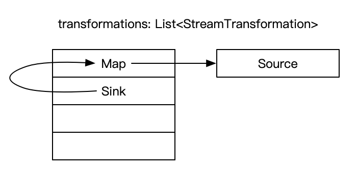
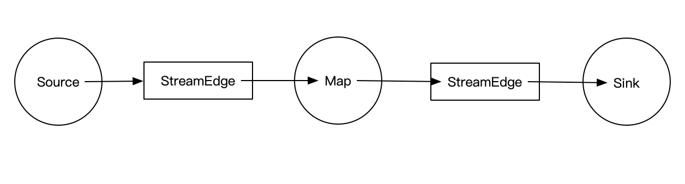

## StreamGraph的生成流程
> 文章基于[flink作业提交流程](./flink作业提交流程.md)， 建议先阅读flink作业提交流程文章再阅读该文章。该篇文章主要介绍Flink任务如何构建StreamGraph。

### 一个例子
介绍一个从Kafka消费，经过Flink处理，然后又写回Kafka的例子[完整的代码](https://github.com/apache/flink/blob/release-1.6/flink-examples/flink-examples-streaming/src/main/scala/org/apache/flink/streaming/scala/examples/kafka/Kafka010Example.scala)。我们看一下代码里面主要逻辑：
```scala
    val env = ...
    val kafkaConsumer = ...
    val messageStream = env.addSource(kafkaConsumer)
      .map(in => prefix + in)
    val kafkaProducer = ...
    messageStream.addSink(kafkaProducer)
    
    env.execute("Kafka010Demo")
```
在上篇文章中，我们知道Flink的客户端最后会通过Java的反射机制调用应用的代码的*main(String[] args)* 方法， 即会执行上述代码块逻辑。上述代码从整体来划分，可以分为三部分：
  - 应用上下文环境的创建，env
  - 转换操作之间的关系的构建过程
  - StreamGraph的构建和提交过程
 
我们主要介绍转换操作之间的关系的构建过程，在上述代码块中stream主要三个组件：
  - source: kafkaConsumer
  - map: Map
  - sink: kafkaProducer
  
在执行*env.addSource(kafkaConsumer)* 时，底层实现如下，主要是返回DataStreamSource
```java
public <OUT> DataStreamSource<OUT> addSource(SourceFunction<OUT> function, String sourceName, TypeInformation<OUT> typeInfo) {

		if (typeInfo == null) {
			if (function instanceof ResultTypeQueryable) {
				typeInfo = ((ResultTypeQueryable<OUT>) function).getProducedType();
			} else {
				try {
					typeInfo = TypeExtractor.createTypeInfo(
							SourceFunction.class,
							function.getClass(), 0, null, null);
				} catch (final InvalidTypesException e) {
					typeInfo = (TypeInformation<OUT>) new MissingTypeInfo(sourceName, e);
				}
			}
		}

		boolean isParallel = function instanceof ParallelSourceFunction;

		clean(function);
		StreamSource<OUT, ?> sourceOperator;
		if (function instanceof StoppableFunction) {
			sourceOperator = new StoppableStreamSource<>(cast2StoppableSourceFunction(function));
		} else {
			sourceOperator = new StreamSource<>(function);
		}

		return new DataStreamSource<>(this, typeInfo, sourceOperator, isParallel, sourceName);
}
```
接着，便是执行*map(..)* 操作，具体的执行逻辑如下：
```java
  1.
  public <R> SingleOutputStreamOperator<R> map(MapFunction<T, R> mapper) {

		TypeInformation<R> outType = TypeExtractor.getMapReturnTypes(clean(mapper), getType(),
				Utils.getCallLocationName(), true);

		return transform("Map", outType, new StreamMap<>(clean(mapper)));
	}
  2.
  public <R> SingleOutputStreamOperator<R> transform(String operatorName, TypeInformation<R> outTypeInfo, OneInputStreamOperator<T, R> operator) {

		// read the output type of the input Transform to coax out errors about MissingTypeInfo
		transformation.getOutputType();

    		// 将当前转换操作链接前一个转换操作
		OneInputTransformation<T, R> resultTransform = new OneInputTransformation<>(
				this.transformation,
				operatorName,
				operator,
				outTypeInfo,
				environment.getParallelism());

		@SuppressWarnings({ "unchecked", "rawtypes" })
		SingleOutputStreamOperator<R> returnStream = new SingleOutputStreamOperator(environment, resultTransform);

    		// 然后将转换操作（除去source操作）存入转换列表容器
		getExecutionEnvironment().addOperator(resultTransform);

		return returnStream;
	}
```
最后便是*addSink(..)* 操作，具体的执行逻辑如下：
```java
public DataStreamSink<T> addSink(SinkFunction<T> sinkFunction) {

		// read the output type of the input Transform to coax out errors about MissingTypeInfo
		transformation.getOutputType();

		// configure the type if needed
		if (sinkFunction instanceof InputTypeConfigurable) {
			((InputTypeConfigurable) sinkFunction).setInputType(getType(), getExecutionConfig());
		}

		StreamSink<T> sinkOperator = new StreamSink<>(clean(sinkFunction));

    		// 将当前转换操作链接前一个转换操作
		DataStreamSink<T> sink = new DataStreamSink<>(this, sinkOperator);
    		// 然后将转换操作（除去source操作）存入转换列表容器
		getExecutionEnvironment().addOperator(sink.getTransformation());
		return sink;
	}
```
至此，我们就获取每个转换操之间的联系了，如图所示：


### StreamGraph的构建过程
上小节，我们已经获取了各个转换操作之间的联系了。接下来便是根据这些信息去构建StreamGraph，而这些构建的具体执行由*env.execute(..)* 完成。
```java
1.
public JobExecutionResult execute(String jobName) throws Exception {
		Preconditions.checkNotNull("Streaming Job name should not be null.");
		//构建StreamGraph
		StreamGraph streamGraph = this.getStreamGraph();
		streamGraph.setJobName(jobName);

		transformations.clear();

		// execute the programs
		if (ctx instanceof DetachedEnvironment) {
			LOG.warn("Job was executed in detached mode, the results will be available on completion.");
			((DetachedEnvironment) ctx).setDetachedPlan(streamGraph);
			return DetachedEnvironment.DetachedJobExecutionResult.INSTANCE;
		} else {
			return ctx
				.getClient()
				.run(streamGraph, ctx.getJars(), ctx.getClasspaths(), ctx.getUserCodeClassLoader(), ctx.getSavepointRestoreSettings())
				.getJobExecutionResult();
		}
	}
2.
public StreamGraph getStreamGraph() {
		if (transformations.size() <= 0) {
			throw new IllegalStateException("No operators defined in streaming topology. Cannot execute.");
		}
		return StreamGraphGenerator.generate(this, transformations);
	}
```
从上述代码里面，我们不难发现StreamGraph具体是由*StreamGraphGenerator.generateInternal(transformations)* 来完成。
```java
private StreamGraph generateInternal(List<StreamTransformation<?>> transformations) {
		// 遍历转换操作列表容器，并从当前的转换操作递归transform它的父转换操作节点，直到当前节点没有父节点
		for (StreamTransformation<?> transformation: transformations) {
			transform(transformation);
		}
		return streamGraph;
	}
```
而*transform(..)* 操作为StreamGraph增加以下信息：
  - 数据源：sources
  - 目标源：sinks
  - 流节点：streamNodes  
    - 每个streamNode拥有inEdge, outEdge以及operator
```java
private Collection<Integer> transform(StreamTransformation<?> transform) {

		if (alreadyTransformed.containsKey(transform)) {
			return alreadyTransformed.get(transform);
		}

		LOG.debug("Transforming " + transform);

		if (transform.getMaxParallelism() <= 0) {

			// if the max parallelism hasn't been set, then first use the job wide max parallelism
			// from theExecutionConfig.
			int globalMaxParallelismFromConfig = env.getConfig().getMaxParallelism();
			if (globalMaxParallelismFromConfig > 0) {
				transform.setMaxParallelism(globalMaxParallelismFromConfig);
			}
		}

		// call at least once to trigger exceptions about MissingTypeInfo
		transform.getOutputType();

		Collection<Integer> transformedIds;
		if (transform instanceof OneInputTransformation<?, ?>) {
			transformedIds = transformOneInputTransform((OneInputTransformation<?, ?>) transform);
		} else if (transform instanceof TwoInputTransformation<?, ?, ?>) {
			transformedIds = transformTwoInputTransform((TwoInputTransformation<?, ?, ?>) transform);
		} else if (transform instanceof SourceTransformation<?>) {
			transformedIds = transformSource((SourceTransformation<?>) transform);
		} else if (transform instanceof SinkTransformation<?>) {
			transformedIds = transformSink((SinkTransformation<?>) transform);
		} else if (transform instanceof UnionTransformation<?>) {
			transformedIds = transformUnion((UnionTransformation<?>) transform);
		} else if (transform instanceof SplitTransformation<?>) {
			transformedIds = transformSplit((SplitTransformation<?>) transform);
		} else if (transform instanceof SelectTransformation<?>) {
			transformedIds = transformSelect((SelectTransformation<?>) transform);
		} else if (transform instanceof FeedbackTransformation<?>) {
			transformedIds = transformFeedback((FeedbackTransformation<?>) transform);
		} else if (transform instanceof CoFeedbackTransformation<?>) {
			transformedIds = transformCoFeedback((CoFeedbackTransformation<?>) transform);
		} else if (transform instanceof PartitionTransformation<?>) {
			transformedIds = transformPartition((PartitionTransformation<?>) transform);
		} else if (transform instanceof SideOutputTransformation<?>) {
			transformedIds = transformSideOutput((SideOutputTransformation<?>) transform);
		} else {
			throw new IllegalStateException("Unknown transformation: " + transform);
		}

		// need this check because the iterate transformation adds itself before
		// transforming the feedback edges
		if (!alreadyTransformed.containsKey(transform)) {
			alreadyTransformed.put(transform, transformedIds);
		}

		if (transform.getBufferTimeout() >= 0) {
			streamGraph.setBufferTimeout(transform.getId(), transform.getBufferTimeout());
		}
		if (transform.getUid() != null) {
			streamGraph.setTransformationUID(transform.getId(), transform.getUid());
		}
		if (transform.getUserProvidedNodeHash() != null) {
			streamGraph.setTransformationUserHash(transform.getId(), transform.getUserProvidedNodeHash());
		}

		if (transform.getMinResources() != null && transform.getPreferredResources() != null) {
			streamGraph.setResources(transform.getId(), transform.getMinResources(), transform.getPreferredResources());
		}

		return transformedIds;
	}
```

如果当前节点存在父节点，则需要增加边(Edge):
```java
for (Integer inputId: inputIds) {
	streamGraph.addEdge(inputId, transform.getId(), 0);
}
```
至此，StreamGraph就构建完成了，此时它拥有数据源(sources)、目标源(sinks)以及流节点(streamNodes)。构建成的StreamGraph如下图所示：

