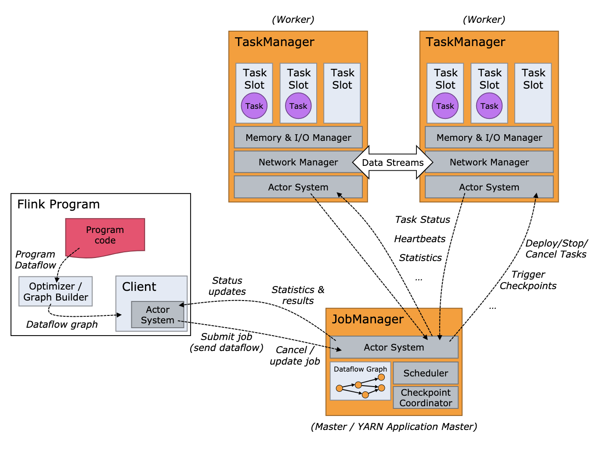

## 任务调度整体概述
Flink任务执行架构，下面这张官方提供的图可以很好的说明：

Flink的运行环境主要由两种类型的进程组成：
  - JobManagers(也可以称为masters)的工作职责是调节分布式执行，他们调度任务（Task），调节检查点（checkpoints），调节失败恢复等等。一般来说Flink的运行环境至少有一个JobManager。在高可用的配置下会有多个JobManager，以其中一个为主，其他的节点为辅。
  - TaskManager(也可以称为workers)的工作职责则是执行数据流中的任务（Task，subtasks），缓存数据以及执行节点之间的数据流交换。一般Flink的运行环境至少有一个TaskManager。
  
而JobManager和TaskManager进程的启动有多种方式：
  - 一种是standalone集群的方式，每种类型的进程都是直接运行在物理服务器上的；
  - 另一种是资源管理框架的方式，例如YARN、Mesos，JobManager和TaskManager进程都运行在容器（container）里
当JobManager和TaskManager进程都被启动后，TaskManager去连接JobManager，并在JobManager中进行注册，上报心跳数据，这样JobManager就能知道当前哪些TaskManager是处理可用的状态，并将任务分配给处于可用状态的TaskManager去执行。

此外在任务调度中还有个比较重要的角色，那就是client。client不属于Flink运行时环境的一部分，但是它用来参数解析、StreamGraph、JobGraph的构建，向资源调度框架（YARN/Mesos）申请资源启动JobManager和TaskManager进程，以及已经将构建好的JobGraph和一些依赖信息发送给JobManager。之后，client可以断开连接，或者保持连接来获取程序的执行情况。
