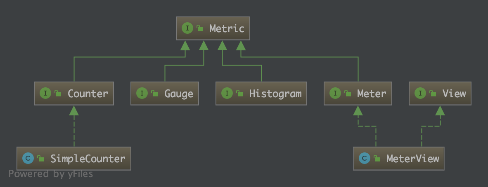
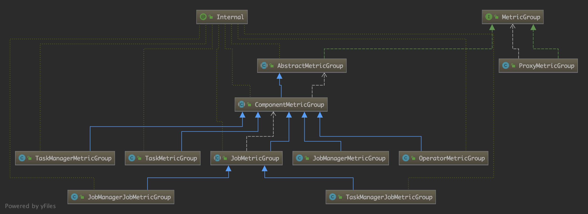

## flink实现自定义MetricsReporter

### 背景
在开发流式计算应用时，我们需要去监测流式计算的吞吐量、计算延时或者其他自定义的指标，所以我们需要去自定义指标报告器，正好flink提供自定义指标报告器的接口`AbstractMetricReporter`，下面我们介绍一下怎么利用flink提供的指标报告器接口实现自定义指标监控。

### 基本概念介绍

#### Metric简介
Flink对于指标监控有自己的一套实现，指标的统计有四种，这些指标都实现了Metric这个接口，而Metric这个接口只是一个标识，本身并没有定义如何实现接口，具体的接口关系如下：



从图中可以看出，Metric这个接口有四个直接类，分别是：
- Gauge: 最简单的度量指标，只是简单的返回一个值，比如返回一个队列中当前元素的个数
- Counter: 计数器，在一些情况下，会比Gauge高效，比如通过一个AtomicLong变量来统计一个队列的长度
- Meter: 吞吐量的度量，也就是一系列事件发生的速率，例如TPS
- Histogram: 度量值的统计结果，如最大值、最小值、平均值、以及分布情况等

#### MetricGroup介绍
为了便于对Metric进行方便管理和区分，可以对Metric进行分组，MetricGroup就是用来实现这个功能的。具体的接口继承关系如下：



AbstractMetricGroup是对新增Metric和子MetricGroup的相关方式进行了实现

#### MetricReporter
MetricReporter是用来向外披露Metric的监控结果的接口。由于MetricReporter的子类在实例化时，都是通过反射机制，所以对于其实现子类，需要有一个公共、无构的造函数，如下：

```java
public interface MetricReporter {

	// ------------------------------------------------------------------------
	//  life cycle
	// ------------------------------------------------------------------------

	/**
	 * Configures this reporter. Since reporters are instantiated generically and hence parameter-less,
	 * this method is the place where the reporters set their basic fields based on configuration values.
	 *
	 * <p>This method is always called first on a newly instantiated reporter.
	 *
	 * @param config A properties object that contains all parameters set for this reporter.
	 */
	void open(MetricConfig config);

	/**
	 * Closes this reporter. Should be used to close channels, streams and release resources.
	 */
	void close();

	// ------------------------------------------------------------------------
	//  adding / removing metrics
	// ------------------------------------------------------------------------

	/**
	 * Called when a new {@link Metric} was added.
	 *
	 * @param metric      the metric that was added
	 * @param metricName  the name of the metric
	 * @param group       the group that contains the metric
	 */
	void notifyOfAddedMetric(Metric metric, String metricName, MetricGroup group);

	/**
	 * Called when a {@link Metric} was should be removed.
	 *
	 * @param metric      the metric that should be removed
	 * @param metricName  the name of the metric
	 * @param group       the group that contains the metric
	 */
	void notifyOfRemovedMetric(Metric metric, String metricName, MetricGroup group);
}
```

#### MetricRegistry
MetricGroup是用来对Metric进行分组管理，MetricReporter是用来对外披露Metric，而MetricRegistry就是这两者之间的桥梁，通过MetricRegister，就可以让MetricReporter感知到在MetricGroup中的Metric发生的变化情况，例如在自定义指标监控中通过MetricGroup添加Metric时，MetricGroup就会调用MetricRegsitry实例去访问在其上面注册过的MetricReporter，来进行指标信息的暴露。此外，对于MetricRegistry这个接口，其实现为MetricRegistryImpl，而在其实例化时，构造函数的入参是一个MetricRegistryConfiguration实例。

##### MetricRegistryConfiguration
在这一步过程中，主要通过配置信息解析出MetricRegistry所需要的配置信息，
- scopeFormats: flink中不同组件的范围格式
- delimiter: 字符串的分隔符，这是一个全局的分隔符
- reporterConfigurations: 配置中每个repoter的名称和其对应的配置对象的列表

#### MetricRegistryImpl
在获取了MetricRegistryConfiguration实例后，在看MetricRegistryImpl的构造函数是实现逻辑
```java
MetricRegistryImpl line 93

public MetricRegistryImpl(MetricRegistryConfiguration config) {
     ...
     // 1.创建单线程的调度线程池
     this.executor = Executors.newSingleThreadScheduledExecutor(new ExecutorThreadFactory("Flink-MetricRegistry"));
     ...
     // 2.通过反射机制加载reporter类
     Class<?> reporterClass = Class.forName(className);
		 MetricReporter reporterInstance = (MetricReporter) reporterClass.newInstance();

		 MetricConfig metricConfig = new MetricConfig();
		 reporterConfig.addAllToProperties(metricConfig);
     		 // 3.通过open(..)方法初始化reporter
		 reporterInstance.open(metricConfig);
		
		 if (reporterInstance instanceof Scheduled) {
        			// 4.开始调度执行reporter
				executor.scheduleWithFixedDelay(
						new MetricRegistryImpl.ReporterTask((Scheduled) reporterInstance), period, period, timeunit);
			} else {
						//...
			}
			reporters.add(reporterInstance);
      ...
}
```
此外，Schedule接口，只是一个repoter接口。
```java
/**
 * Interface for reporters that actively send out data periodically.
 */
public interface Scheduled {

	/**
	 * Report the current measurements. This method is called periodically by the
	 * metrics registry that uses the reporter.
	 */
	void report();
}
```
实现Scheduler接口的repoter，表示其需要被定期调度执行，定期执行的就是report(..)方法，没有实现Scheduler接口的repoter(..)是不会被定期执行的。

### 举个例子
当我们自定义指标监控时，首先我们需要准备是：
- MetricRegistryConfiguation：通过加载配置文件来初始化
- MetricRegistry：通过MetricRegistryConfiguation实例来创建MetricRegistry实例
- AbstractMetricGroup的实现类：将MetricRegistry实例注册到AbstractMetricGroup的实现类

现在我们就可以使用AbstractMetricGroup的实现类的实例来添加Metric了。Metric的添加逻辑的入口在AbstractMetricGroup的addMetric方法中，具体如下：
```java
AbstractMetricGroup line 356

	protected void addMetric(String name, Metric metric) {
		if (metric == null) {
			return;
		}
		// add the metric only if the group is still open
		synchronized (this) {
			if (!closed) {
				Metric prior = metrics.put(name, metric);
				// check for collisions with other metric names
				if (prior == null) {
					// no other metric with this name yet
					if (groups.containsKey(name)) {
					   //...
					}
					// 调用MetricRegistry实例来处理新添加的metric，即将新加的metric注册到当前的Group
					registry.register(metric, name, this);
				}
				else {
					// we had a collision. put back the original value
					metrics.put(name, prior);
				}
			}
		}
	}
```
接下来我们看看MetricRegistry.registry(..)的实现逻辑
```java
MetricRegistryImpl line 318

	public void register(Metric metric, String metricName, AbstractMetricGroup group) {
		synchronized (lock) {
			if (isShutdown()) {
				LOG.warn("Cannot register metric, because the MetricRegistry has already been shut down.");
			} else {
				if (reporters != null) {
					// 通知所有的reporters
					for (int i = 0; i < reporters.size(); i++) {
						MetricReporter reporter = reporters.get(i);
						try {
							if (reporter != null) {
								FrontMetricGroup front = new FrontMetricGroup<AbstractMetricGroup<?>>(i, group);
								// 然后调用reporter的接口，通知reporter
								reporter.notifyOfAddedMetric(metric, metricName, front);
							}
						} catch (Exception e) {
							LOG.warn("Error while registering metric.", e);
						}
					}
				}
				try {
					if (queryService != null) {
						MetricQueryService.notifyOfAddedMetric(queryService, metric, metricName, group);
					}
				} catch (Exception e) {
					LOG.warn("Error while registering metric.", e);
				}
				try {
					if (metric instanceof View) {
						if (viewUpdater == null) {
							viewUpdater = new ViewUpdater(executor);
						}
						viewUpdater.notifyOfAddedView((View) metric);
					}
				} catch (Exception e) {
					LOG.warn("Error while registering metric.", e);
				}
			}
		}
	}
```

