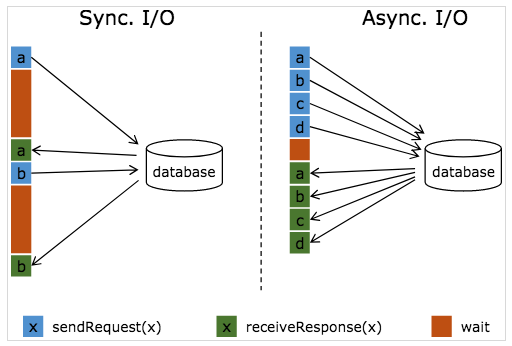
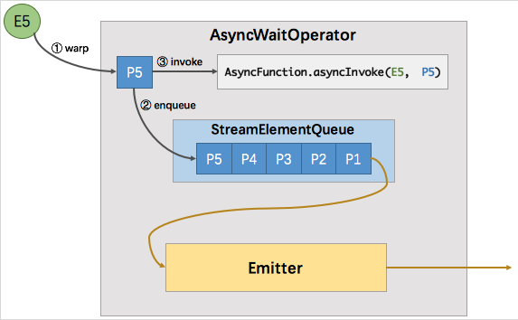
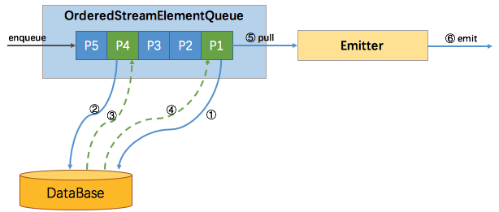
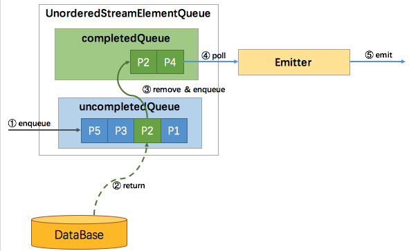
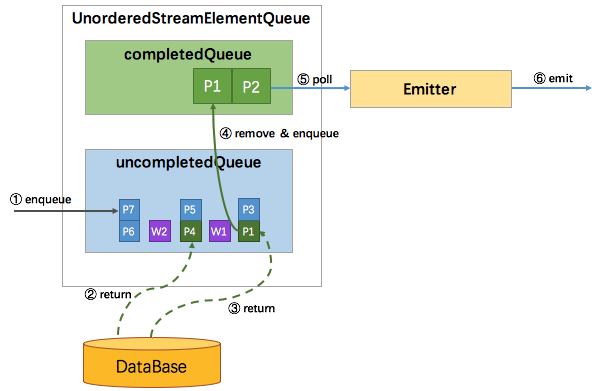

## Flink里面的异步调用：AsyncDataStream

### 背景
Async I/O是一个为了解决Flink与外部系统交互时导致网络延迟问题的非常好的特性

流计算系统中经常需要与外部系统进行交互，比如需要查询外部数据库以关联上用户信息。一般情况下，我们的实现方式是向数据库发送用户a的查询信息，然后等待结果返回，在这之前，我们无法发送用户b的查询请求。这就是一种同步访问的模式，如下图左边所示：



图中棕色的长条表示等待时间，可以发现网络等待时间极大地阻塞了吞吐和延迟。为了解决同步访问的问题，异步模式可以并发地处理多个请求和回复。也就是说，我们可以连续地向数据库发送用户a,b,c,d等的请求，与此同时，哪个请求的回复先返回了就处理哪个回复，从而连续的请求之间不需要阻塞等待，如上图右边所示。这正是Async I/O的实现原理。

### Async I/O
使用 Async I/O 的前提是需要一个支持异步请求的客户端。当然，没有异步请求客户端的话也可以将同步客户端丢到线程池中执行作为异步客户端。下面我们看一下如何使用Async I/O

```scala
val stream: DataStream[Int] = ...
val resultStream: DataStream[(String, Int)] = AsyncDataStream.(un)orderedWait(stream, 10000, TimeUnit.MILLISECONDS, 100) {
  (input, collector: ResultFuture[(String, Int)]) => 
  Future {
    // 线程池执行DB客户端查询
    val ret: String = client.query()
    // 标记异步查询完成
    collector.complete(Seq[(ret, input)])
  }(ExecuteContext.global)
}
```
AsyncDataStream有两个静态方法，orderedWait和unorderedWait，对应了两种输出模式：有序和无序。
  - 有序：消息的发送顺序和接收顺序相同（包括watermark），也就是先进先出。
  - 无序：
    - 在ProcessingTime的情况下，完全无序，先返回的结果先发送。
    - 在EventTime的情况下，watermark不能超越消息，消息也不能超越watermark，也即是说watermark定义的顺序的边界。在两个watermark之间的消息的发送是无序的，但是在watermark之后的消息不能先于该watermark之前的消息发送。

### 原理实现
AsyncDataStream.(un)orderedWait 的主要工作就是创建了一个 AsyncWaitOperator。AsyncWaitOperator 是支持异步 IO 访问的算子实现，该算子会运行 AsyncFunction 并处理异步返回的结果，其内部原理如下图所示。



如图所示，AsyncWaitOperator主要有两部分组成：StreamElementQueue和Emitter。StreamElementQueue是一个ArrayDeque队列，里面的元素都是正在处理的请求。Emitter是一个单独的线程，负责发送消息（收到的异步回复）给下游。

图中E5表示进入该算子的第五个元素（“Element-5”），在执行过程中首先会将其包装成一个“StreamRecordQueueEntry”P5，然后将P5放入队列中。最后调用AsyncFunction的asyncInvoke()方法，该方法会向外部发起一个异步的请求，并注册回调。该回调会在异步请求成功返回时调用resultFuture.complete(..)标记队列中对应的元素为完成状态，并通知Emitter线程有完成的消息可以发送了。Emitter就会从队列中拉取完成的StreamElementEntry，并
从StreamElementEntry中取出消息发送给下游。

下面我么看一下AsyncWaitOperator的代码实现：
```java
AsyncWaitOperator line 132

	public void setup(StreamTask<?, ?> containingTask, StreamConfig config, Output<StreamRecord<OUT>> output) {
		super.setup(containingTask, config, output);

		this.checkpointingLock = getContainingTask().getCheckpointLock();

		this.inStreamElementSerializer = new StreamElementSerializer<>(
			getOperatorConfig().<IN>getTypeSerializerIn1(getUserCodeClassloader()));

		// create the operators executor for the complete operations of the queue entries
		this.executor = Executors.newSingleThreadExecutor();
    		// 初试化Queue
		switch (outputMode) {
			case ORDERED:
				queue = new OrderedStreamElementQueue(
					capacity,
					executor,
					this);
				break;
			case UNORDERED:
				queue = new UnorderedStreamElementQueue(
					capacity,
					executor,
					this);
				break;
			default:
				throw new IllegalStateException("Unknown async mode: " + outputMode + '.');
		}
	}
  
line 162

public void open() throws Exception {
		super.open();

		// create the emitter
		this.emitter = new Emitter<>(checkpointingLock, output, queue, this);

		// start the emitter thread
    		// 启动Emitter线程，从队列中处理完成的消息，并发给下游算子
		this.emitterThread = new Thread(emitter, "AsyncIO-Emitter-Thread (" + getOperatorName() + ')');
		emitterThread.setDaemon(true);
		emitterThread.start();

		// process stream elements from state, since the Emit thread will start as soon as all
		// elements from previous state are in the StreamElementQueue, we have to make sure that the
		// order to open all operators in the operator chain proceeds from the tail operator to the
		// head operator.
    		// 状态恢复
		if (recoveredStreamElements != null) {
			for (StreamElement element : recoveredStreamElements.get()) {
				if (element.isRecord()) {
					processElement(element.<IN>asRecord());
				}
				else if (element.isWatermark()) {
					processWatermark(element.asWatermark());
				}
				else if (element.isLatencyMarker()) {
					processLatencyMarker(element.asLatencyMarker());
				}
				else {
					throw new IllegalStateException("Unknown record type " + element.getClass() +
						" encountered while opening the operator.");
				}
			}
			recoveredStreamElements = null;
		}

	}

line 199
	public void processElement(StreamRecord<IN> element) throws Exception {
		final StreamRecordQueueEntry<OUT> streamRecordBufferEntry = new StreamRecordQueueEntry<>(element);

		if (timeout > 0L) {
			// register a timeout for this AsyncStreamRecordBufferEntry
			long timeoutTimestamp = timeout + getProcessingTimeService().getCurrentProcessingTime();

			final ScheduledFuture<?> timerFuture = getProcessingTimeService().registerTimer(
				timeoutTimestamp,
				new ProcessingTimeCallback() {
					@Override
					public void onProcessingTime(long timestamp) throws Exception {
						userFunction.timeout(element.getValue(), streamRecordBufferEntry);
					}
				});

			// Cancel the timer once we've completed the stream record buffer entry. This will remove
			// the register trigger task
			streamRecordBufferEntry.onComplete(
				(StreamElementQueueEntry<Collection<OUT>> value) -> {
					timerFuture.cancel(true);
				},
				executor);
		}
    		// 将消息包装成StreamRecordBufferEntry，并入队列
		addAsyncBufferEntry(streamRecordBufferEntry);
    		//调用用户实现的AsyncFunction的asyncInvoke逻辑处理上游数据和访问外部存储数据
		userFunction.asyncInvoke(element.getValue(), streamRecordBufferEntry);
	}
```

### 消息的顺序性
上文提到 Async I/O 提供了两种输出模式。其实细分有三种模式: 有序，ProcessingTime 无序，EventTime 无序。Flink 使用队列来实现不同的输出模式，并抽象出一个队列的接口（StreamElementQueue），这种分层设计使得AsyncWaitOperator和Emitter不用关心消息的顺序问题。StreamElementQueue有两种具体实现，分别是 OrderedStreamElementQueue 和 UnorderedStreamElementQueue。UnorderedStreamElementQueue 比较有意思，它使用了一套逻辑巧妙地实现完全无序和 EventTime 无序。

#### 有序
有序比较简单，使用一个队列就能实现。所有新进入该算子的元素（包括 watermark），都会包装成 Promise 并按到达顺序放入该队列。如下图所示，尽管P4的结果先返回，但并不会发送，只有 P1 （队首）的结果返回了才会触发 Emitter 拉取队首元素进行发送。



#### ProcessingTime无序
ProcessingTime 无序也比较简单，因为没有 watermark，不需要协调 watermark 与消息的顺序性，所以使用两个队列就能实现，一个 uncompletedQueue 一个 completedQueue。所有新进入该算子的元素，同样的包装成 Promise 并放入 uncompletedQueue 队列，当uncompletedQueue队列中任意的Promise返回了数据，则将该 Promise 移到 completedQueue 队列中，并通知 Emitter 消费。如下图所示：



#### EventTime无序

EventTime 无序类似于有序与 ProcessingTime 无序的结合体。因为有 watermark，需要协调 watermark 与消息之间的顺序性，所以uncompletedQueue中存放的元素从原先的 Promise 变成了 Promise 集合。如果进入算子的是消息元素，则会包装成 Promise 放入队尾的集合中。如果进入算子的是 watermark，也会包装成 Promise 并放到一个独立的集合中，再将该集合加入到 uncompletedQueue 队尾，最后再创建一个空集合加到 uncompletedQueue 队尾。这样，watermark 就成了消息顺序的边界。只有处在队首的集合中的 Promise 返回了数据，才能将该 Promise 移到 completedQueue 队列中，由 Emitter 消费发往下游。只有队首集合空了，才能处理第二个集合。这样就保证了当且仅当某个 watermark 之前所有的消息都已经被发送了，该 watermark 才能被发送。过程如下图所示：



### 快照与恢复
分布式快照机制是为了保证状态的一致性。我们需要分析哪些状态是需要快照的，哪些是不需要的。首先，已经完成回调并且已经发往下游的元素是不需要快照的。否则，会导致重发，那就不是 exactly-once 了。而已经完成回调且未发往下游的元素，加上未完成回调的元素，就是上述队列中的所有元素。

所以快照的逻辑也非常简单，(1)清空原有的状态存储，(2)遍历队列中的所有 Promise，从中取出 StreamElement（消息或 watermark）并放入状态存储中，(3)执行快照操作。

恢复的时候，从快照中读取所有的元素全部再处理一次，当然包括之前已完成回调的元素。所以在失败恢复后，会有元素重复请求外部服务，但是每个回调的结果只会被发往下游一次。

