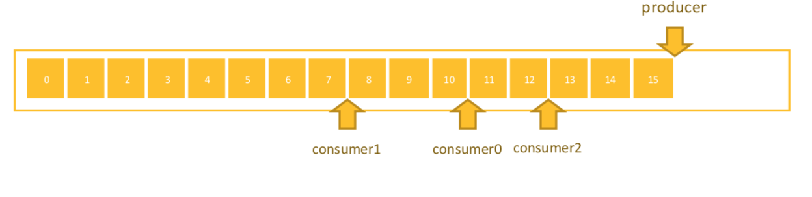
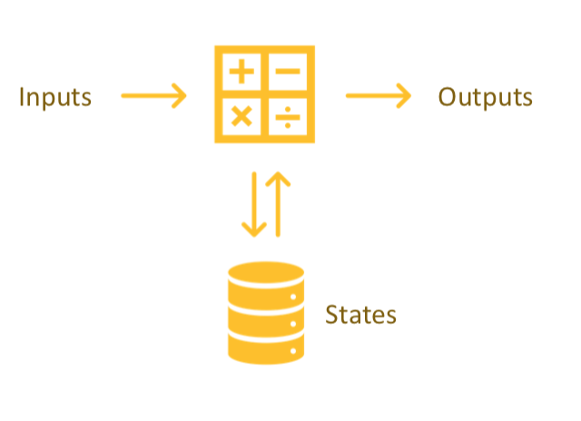
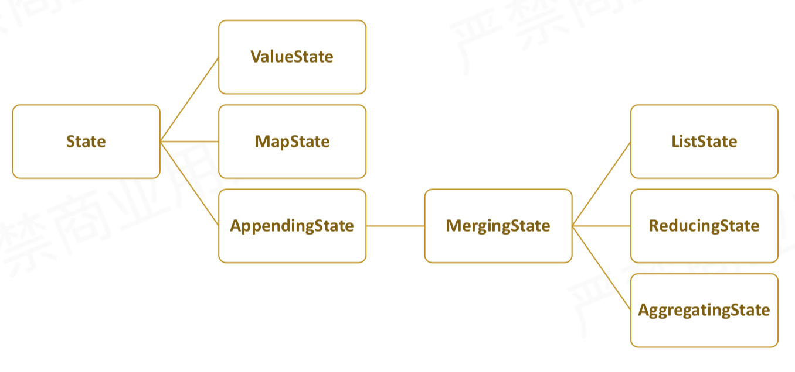
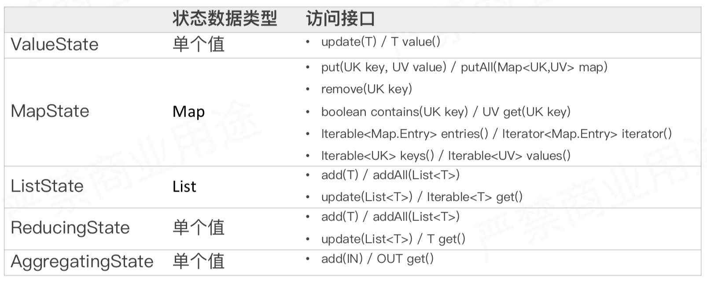

## 状态管理与容错机制

### 状态管理的基本概念

#### 什么是状态
为了说明什么是状态，我们先来看两个例子，第一个例子就是无状态计算的例子（消费延时计算）。在一个消息队列里，一个生产者持续写入数据，同时多个消费组分别消费数据，如下图所示，然后让我们实现实时统计每个消费者消费积压值需求。



针对这样的需求，我们只需要在一个操作算子里对每条数据执行减法操作，例如*consumer0 - producer*就可以得到consumer0的消费积压值，不需要依赖其他。这样就是一个无状态的计算。
```
输入数据：
{
    "timestamp": 1555516800,
    "offset":
    {
        "producer": 15,
        "consumer0": 10,
        "consumer1": 7,
        "consumer2": 12
} }

输出数据：
{
    "timestamp": 1555516800,
    "lag":
    {
        "consumer0": 5,
        "consumer1": 8,
        "consumer2": 3
} }
```

下面我们再看看有状态计算的例子（访问量统计），通过nginx访问日志（每个请求访问一个URL地址），如下图所示，实时计算统计每个地址总共被访问次数的需求。



当我们实现这个需求时，通过算子去处理单条数据，不能得到完整的计算结果，依赖之前计算的结果，而这个之前的计算结果就是我们说的*状态*。
```
输入数据：
[{
    "@timestamp": "18/Apr/2019:00:00:00",
    "remote_addr": "127.0.0.1",
    "request": "GET",
    "url": "/api/a"
}, {
    "@timestamp": "18/Apr/2019:00:00:01",
    "remote_addr": "127.0.0.1",
    "request": "POST",
    "url": "/api/b"
}, {
    "@timestamp": "18/Apr/2019:00:00:00",
    "remote_addr": "127.0.0.1",
    "request": "GET",
    "url": "/api/a"
}]

输出数据：
[{
    "url": "/api/a",
    "count": 1
}, {
    "url": "/api/b",
    "count": 1
}, {
    "url": "/api/a",
    "count": 2 }]
```

知道了什么是状态，那么我们平时都在什么时候去使用状态呢？下面我们罗列一下使用状态的场景：
- 去重：通过状态记录所有的主键实现
- 窗口计算： 已进入的未触发的数据
- 机器学习/深度学习： 训练的模型及参数
- 访问历史数据：需要与历史进行对比

### 状态的类型与使用示例

#### Keyed State and Operator State

| Keyed State| Operator State|
|:-----------|:--------------|
|只能用在KeyedStream上的算子中|可以用于所有算子|
|每个Key对应一个State，每个Operator实例处理多个Key，访问相应的多个State|一个Operator实例对应一个State|
|并发改变，State随着Key在实例间迁移|并发改变时有多种重新分配方式可选：1）均匀分配；2）合并后每个得到全量|
|通过RuntimeContext访问，而RichFunction子类可以获取RuntimeContext | 实现CheckpointedFunction或者ListCheckpointed接口|
|支持的数据结构：1）ValueState；2）ListState；3）ReducingState；4）AggregatingState；5）MapState；| 支持的数据结构：ListState |


#### Keyed State之间的关系和差异

由于我们在实际使用过程中使用到Keyed State比较多，所以先介绍一下几种Keyed State之间的关系：



然后我们再看几种Keyed State之间的差异：



#### 举个🌰

我们通过一个例子，来实战一下怎么使用状态。我们通过继承RichFunction可以获取状态，具体在open(..)方法中，通过getRuntimeContext.getState(..)来获取状态对象，然后在我们处理数据的时候就可以使用上获取到的状态数据了，具体的实现如下代码

```java
static class StateMachineMapper extends RichFlatMapFunction<Event, Alert> {

		/** The state for the current key. */
		private ValueState<State> currentState;

		@Override
		public void open(Configuration conf) {
			// get access to the state object
			currentState = getRuntimeContext().getState(
						new ValueStateDescriptor<>("state", State.class));
		}

		@Override
		public void flatMap(Event evt, Collector<Alert> out) throws Exception {
			// get the current state for the key (source address)
			// if no state exists, yet, the state must be the state machine's initial state
			State state = currentState.value();
			if (state == null) {
				state = State.Initial;
			}

			// ask the state machine what state we should go to based on the given event
			State nextState = state.transition(evt.type());

			if (nextState == State.InvalidTransition) {
				// the current event resulted in an invalid transition
				// raise an alert!
				out.collect(new Alert(evt.sourceAddress(), state, evt.type()));
			}
			else if (nextState.isTerminal()) {
				// we reached a terminal state, clean up the current state
				currentState.clear();
			}
			else {
				// remember the new state
				currentState.update(nextState);
			}
		}
	}
```

### 容错机制与故障恢复

#### 状态保存与恢复
在Flink里使用Checkpoint（分布式快照）来对程序中的状态进行备份，当运行作业发生故障时，Flink将整个作业的所有Task都回滚到最后一次成功Checkpoint的状态，然后从上次成功的chk开始继续处理。注意，要实现上述故障恢复的必要条件是数据源支持数据重发，例如Apache Kafka。

下面我们看一下在Flink程序里，如何开启chk并配置chk。
```java

StreamExecutionEnvironment env = StreamExecutionEnvironment.getExecutionEnvironment(); 
env.enableCheckpointing(1000);
env.getCheckpointConfig().setCheckpointingMode(CheckpointingMode.EXACTLY_ONCE); 
env.getCheckpointConfig().setMinPauseBetweenCheckpoints(500); env.getCheckpointConfig().setCheckpointTimeout(60000);
env.getCheckpointConfig().setMaxConcurrentCheckpoints(1);
env.getCheckpointConfig().enableExternalizedCheckpoints(ExternalizedCheckpointCleanup.RETAIN_ON_CANCELLATION);
 
```

此外，Flink还提供了另一种保存状态的方式，即Savepoint。下面我们对比一下Checkpoint与Savepoint之间的差别：

|区别项|Checkpoint|Savepoint|
|:--|:---------|:--------|
|触发管理方式|由Flink自动触发并管理|由用户手动触发并管理|
|主要用途|在Task发生异常时快速恢复作业|有计划地进行备份，使作业能停止再恢复，例如修改代码、调整并发度|
|特点|1）轻量；2）自动从故障中恢复；3）在作业停止后默认清除|1）持久；2）以标准格式存储，运行代码或者配置发生改变；3）手动触发从Savepoint中恢复|


#### 状态后端类型

|区别项|MemoryStateBackend|FsStateBackend|RocksDBStateBackend|
|:----|:-----------------|:-------------|:-------------------|
|构造方法|MemoryStateBackend(int maxStateSize, boolean asynchronousSnapshots)|FsStateBackend(URI checkpointDataUri, boolean asynchronousSnapshots)|RocksDBStateBackend(URI checkpointDataUri, boolean enableIncrementalCheckpointing)|
|存储方式|1）State:TaskManager内存；2）Checkpoint: JobManager内存|1）State: TaskManager内存；2）Checkpoint: 外部文件系统（本地或者HDFS）|1）State: TaskManager上的KV数据库（RocksDB）(实际上使用内存+磁盘)；2）Checkpoint: 外部文件系统（本地或者HDFS）|
|容量限制|1）单个State maxStateSize默认5M；2）maxStateSize <= akka.framesize默认10M；3）总大小不超过JobManager的内存|1）单个TaskManager上State总量不超过它的内存；2）总大小不超过配置的文件系统容量|1）单个TaskManager上的State总量不超过它的内存+磁盘；2）单个Key最大2G；3）总大小不超过配置的文件系统容量|
|推荐使用场景|1）本地测试；2）几乎无状态的作业，例如ETL任务；3）不推荐在生产场景使用|1）常规使用状态的作业，例如分钟级别的窗口聚合、join；2）需要开始HA的作业；3）可以在生产环境使用|1）超大状态作业，例如天级别的窗口聚合；2）需要开始HA的作业；3）对状态读写性能要写不高的作业；4）可以在生产场景使用|
