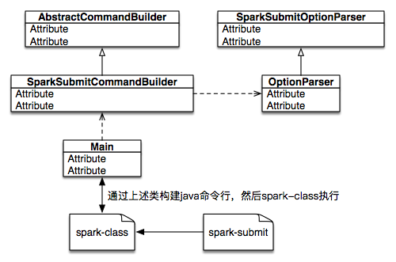
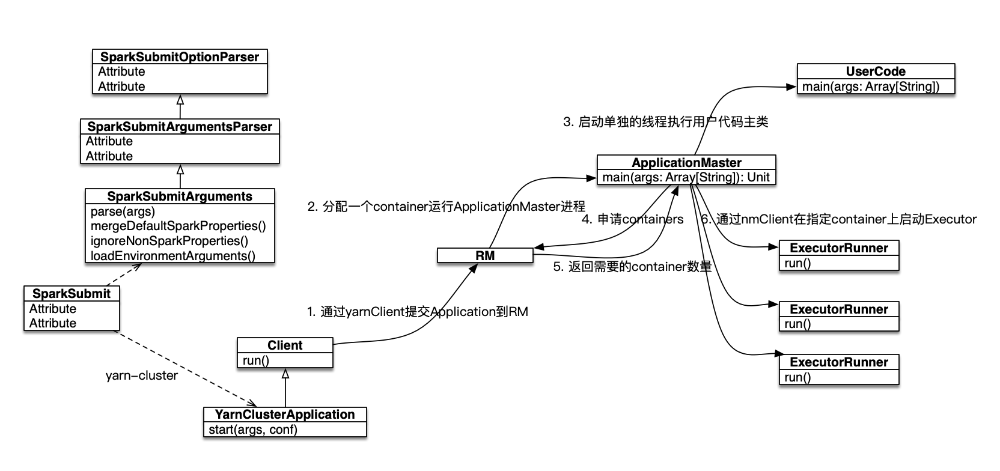

## spark任务提交流程

### 应用参数校验

当我们提交spark任务时，一般有两个方式提交。一是自建的提交平台；二是通过spark自带的脚本spark-submit提交。
这里我们讨论spark-submit提交方式，这个方式使用shell脚本与Java程序混合使用的方式达到提交的效果，下面是它的整体结构如图一所示：

当我们使用spark-submit脚本提交任务时，实际上触发的脚本是spark-class脚本，而spark-class里的逻辑是启动一个Java进程，这个Java进程的主类是”org.apche.spark.launcher.Main”，入参是脚本的所有参数。
现在程序的来到了Main类中，首先它创建SparkSubmitCommandBuilder，在这个的初试过程便会去解析所有入参，具体的执行交由OptionParser完成，而OptionParser继承了SparkSubmitOptionParser类的解析参数的逻辑。
所有解析后的参数值被存储在AbstractCommandBuilder。最后通过SparkSubmitCommandBuilder.buildCommand(...)去构建Java命令，主类是”org.apche.spark.deploy.SparkSubmit”，并打印出来。
打印出来的Java命令被spark-class脚本存在在CMD数组里，并执行。

### 应用提交与运行

下面我们把我们的目光放到SparkSubmit上，前期的入参解析，我觉得是对入参的一个检验过程以及适配其他方式提交。下图是应用提交以运行的整体图：

当spark-class脚本启动主类为SparkSubmit的Java进程时，会触发对入参的解析逻辑、加载默认配置文件、合并默认配置信息、过滤非spark配置信息、加载环境变量最后便是验证参数。
然后提交任务，在提交任务过程中主要做这几件事：

  - 为提交准备环境变量，根据不同的master、deploy-mode，提供不同的子主类，
       - 例如(standalone, client)子主类便是应用的主类；
       - (standalone, cluster)子主类便是RestSubmissionClientApp/ClientApp，其中RestSubmissionClientApp是通过HTTP方式（REST）与master进行交互的，而ClientApp是通过RPC方式与master进行交互；
       - (yarn cluster)子主类便是YarnClusterApplication，在它里面通过rmClient提交应用（一个指定了启动ApplicationMaster进程Java命令的container）到RM上。
  - 下面便是通过Java的反射机制去运行子主类，到这SparkSubmit的任务就全部完成。

接下来我们的关注点来到了ApplicationMaster上，RM通过分配一个container，并在这个container上启动ApplicationMaster进程，例如步骤【2】
这个时候ApplicationMaster进程就已经启动起来了，在它里面主要逻辑分为下面几部分：
  - 单独启动一个线程去启动用户代码的主类，例如步骤【3】
  - 向RM申请container资源，例如步骤【4】
  - 根据申请到的资源，利用nmClient在指定的container上启动Executor进程，例如步骤【6】  
  
到此，整个任务启动流程完成。  