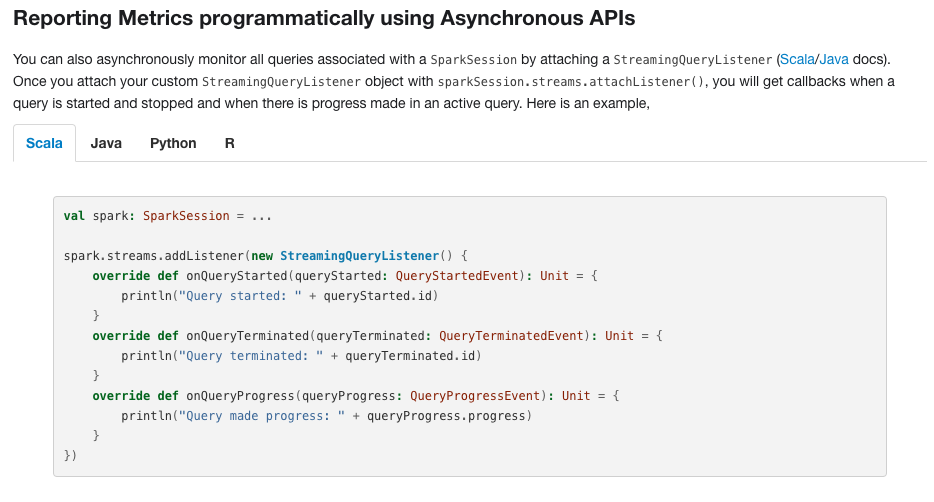
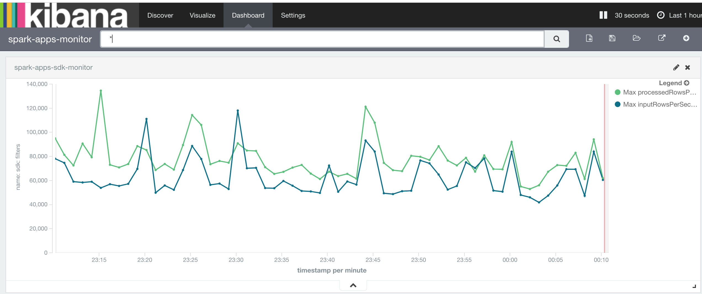

## structured streaming的查询实时监控设计与实现

### 背景
在spark streaming时代，我们还能在spark ui查看到有多少条数据进入spark计算引擎，spark处理这些数据花费了多少时间以及延时多少时间。但是我们进入structured streaming时代时，我们在spark ui上查看不到这些信息了，只能查看到各个query的列表，这对于实时计算来说是一个短处，不过spark官方提出另一个处理方案，就是用户可以获取每个query的metrics信息。

### 技术方案
从上个小节，我们知道用户可以自定义获取structured streaming应用里的各个query的metrics信息，如果想要实时监控某些指标，只需要将这些指标写入到外部存储，然后通过可视化的工具呈现数据即可。目前，比较流行的数据可视化的方案有ElasticateSearch + Kibana，所以接下来将采用将query的metrics信息写入Es，然后通过Kibana呈现数据的方案来实现SS的查询实时监控。

首先，我们要处理的问题便是将query的metrics写入到Es里，通过继承StreamingQueryListener来获取query信息，然后sparkSession为每个steams增加Listener，具体实现如下：
```scala
1.
//spark是SparkSession实例
spark.streams.addListener(new QueryListener("hostname", port, "elasticsearch", "spark-idx", "query-metrics"))
2.
//监听具体实现
class QueryListener(host: String, port: Int, cluster: String, index: String, mapping: String)
  extends StreamingQueryListener {

//  private var client: TransportClient = _
  private val clientCached: AtomicReference[TransportClient] = new AtomicReference[TransportClient]()

  override def onQueryStarted(event: StreamingQueryListener.QueryStartedEvent): Unit = {
    println("Query started: " + event.id)
  }

  override def onQueryProgress(event: StreamingQueryListener.QueryProgressEvent): Unit = {
    println(event.progress.prettyJson)

    if (clientCached.get() != null) {
      sendToEs(event.progress)
    } else {

      val config = new util.HashMap[String, String]()
      config.put("bulk.flush.max.actions", "1")
      config.put("cluster.name", cluster)

      val settings = ImmutableSettings.settingsBuilder()
        .put(config)
        .build()
      clientCached.set(new TransportClient(settings)
        .addTransportAddress(new InetSocketTransportAddress(host, port)))
      sendToEs(event.progress)
    }

  }

  override def onQueryTerminated(event: StreamingQueryListener.QueryTerminatedEvent): Unit = {
    println("Query made progress: " + event.id)
  }

  def sendToEs(data: StreamingQueryProgress): Unit = {
    val indexRequest = new IndexRequest(index, mapping, data.timestamp)
       .source(mapAsJavaMap(insertJson(data)))

    val updateRequest = new UpdateRequest(index, mapping, data.timestamp)
      .doc(mapAsJavaMap(updateJson(data)))
      .upsert(indexRequest)

    clientCached.get().update(updateRequest).get()
  }

  def insertJson(data: StreamingQueryProgress): Map[String, AnyRef] = {
    val simpleDataFormat = new SimpleDateFormat("yyyy-MM-dd'T'HH:mm:ss")
    val ts = simpleDataFormat.parse(data.timestamp).getTime + 8*60*60*1000 //格林治时间转换

    Map("id" -> data.id.toString.asInstanceOf[AnyRef],
    "name" -> data.name.asInstanceOf[AnyRef],
    "inputRowsPerSecond" -> data.inputRowsPerSecond.asInstanceOf[AnyRef],
    "processedRowsPerSecond" -> data.processedRowsPerSecond.asInstanceOf[AnyRef],
    "timestamp" -> ts.asInstanceOf[AnyRef])
  }

  def updateJson(data: StreamingQueryProgress): Map[String, AnyRef] = {
    Map("inputRowsPerSecond" -> data.inputRowsPerSecond.asInstanceOf[AnyRef],
      "processedRowsPerSecond" -> data.processedRowsPerSecond.asInstanceOf[AnyRef])
  }
}
```
接下来便是Es存储的安装与使用
1. 下载1.7.3版本的Es [下载地址](https://www.elastic.co/downloads/past-releases/elasticsearch-1-7-3)
2. 解压缩文件：tar -zxvf elasticsearch-1.7.3.tar.gz 
3. 进去Es的安装目录并启动Es服务：
    - cd elasticsearch-1.7.3
    - ./bin/elasticsearch -d //-d表示后台运行
4. 创建index: curl -XPUT "http://localhost:9200/spark-idx" 
5. 创建type: curl -XPUT "http://localhost:9200/spark-idx/_mapping/query-metrics" -d '{"query-metrics":{"properties":{"id":{"type":"string"},"name":{"type":"string"},"inputRowsPerSecond":{"type":"double"},"processedRowsPerSecond":{"type":"double"},"timestamp":{"type":"date"}},"_ttl":{"enabled":true,"default":"1d"}}}'

最后便是Kibana的安装与使用
1. 下载4.1.3版本的Kibana [下载地址](https://www.elastic.co/downloads/past-releases/kibana-4-1-3)
2. 解压缩文件：tar -zxvf kibana-4.1.3.tar.gz 
3. 进入Kibana的安装目录并启动Kibana服务：
    - cd kibana-4.1.3
    - nohup ./bin/kibana &
4. 最后便可以通过浏览器访问[http://localhost:5601](http://localhost:5601)来查看监控信息

### 结果展示

